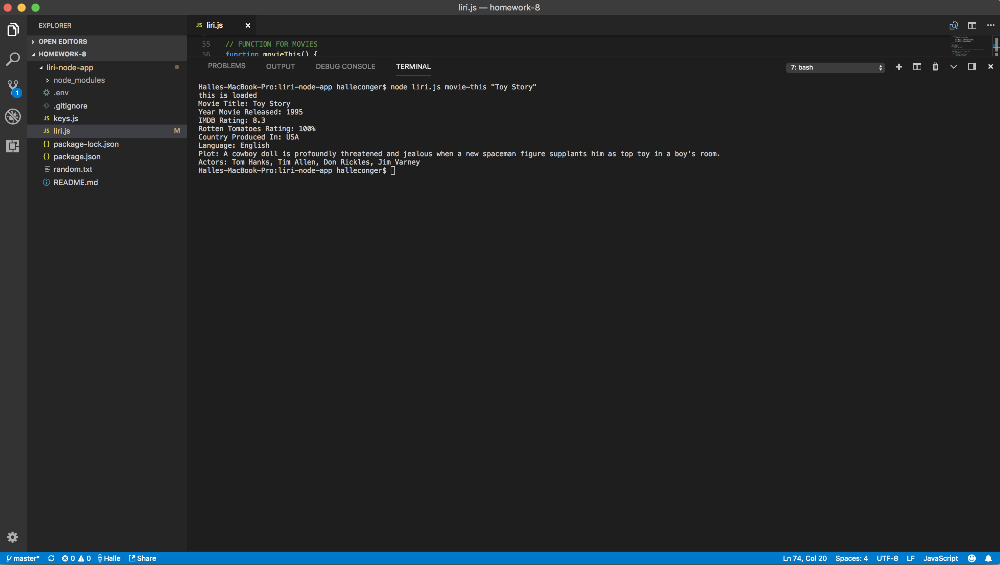

# liri-node-app

The LIRI Application is a Language Interpretation and Recognition Interface that uses node to take in parameters via the command line and returns specific data to the user. 

In this application, we use the following NPM packages: 
> * Twitter
> * Node-Spotify-API
> * Request
> * DotEnv

This application functions in four ways:

1. `node liri.js my-tweets`
> * Displays the last 20 tweets and when they were created

2. `node liri.js spotify-this-song '<song name here>'`
> * Displays the following information about the user's song choice:
>> * artist
>> * preview link of the song from Spotify
>> * album the song is from
> * If no song is entered, the information from the song "The Sign" will be displayed.

3. `node liri.js movie-this '<movie name here>'`
> * Using the OMDB API (http://www.omdbapi.com) the following movie information will be displayed based on the user's input:
>> * movie title
>> * year movie was released
>> * IMDB rating of movie
>> * rotten tomatoes rating of movie
>> * country where movie was produced
>> * language of movie
>> * plot of movie
>> * actors in the movie
> * If no movie is entered, the information from the movie "Mr. Nobody" will be displayed.

4. `node liri.js do-what-it-says`
> * Using the random.txt file, the text inside will be applied to call one of the LIRI's commands.

